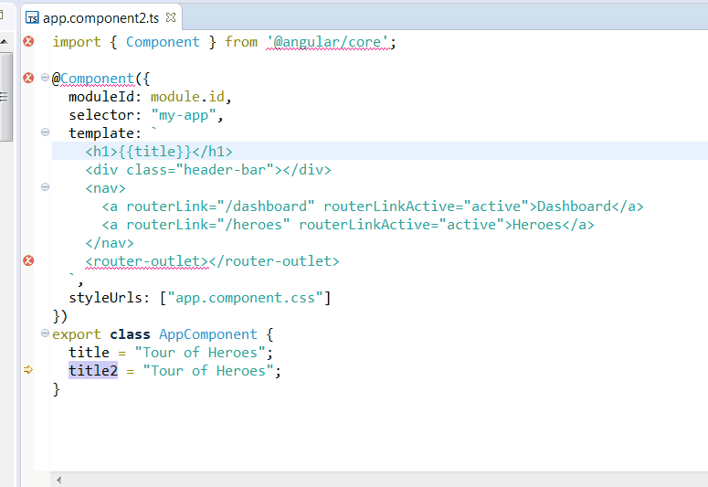

# Language Service Plugins with Proxies

[Language Service Plugins with Proxies](https://github.com/Microsoft/TypeScript/issues/11976) is [planned for the future of TypeScript](https://github.com/Microsoft/TypeScript/wiki/Roadmap#future) (TypeScript 2.4 ?). This feature gives the capability to extend TypeScript tsserver completion, definition, diagnostics, etc with custom plugins. Today it exists 2 plugins :

 * [Angular2 language service](https://github.com/angular/angular/issues/7482) which provide completion, definition, diagnostics for @Component/template
 * [tslint language service](https://github.com/angelozerr/tslint-language-service) which provides diagnostics, codefix by consuming [tslint](https://github.com/palantir/tslint).
 
When a TypeScript file must be validated by tslint, the tslint language service plugin uses the parsed TypeScript file from tsserver and avoid double parsing of TypeScript file (one by tsserver and one by tslint).

Current work can be found in [this PR](https://github.com/Microsoft/TypeScript/pull/12231)

# What is the goal of tsserver-plugins?

[Language Service Plugins with Proxies](https://github.com/Microsoft/TypeScript/issues/11976)  will be available for a future version of TypeScript (TypeScript 2.4?). For the impatient guys, 
[tsserver-plugins](https://github.com/angelozerr/tsserver-plugins) gives you the capability to consume plugins with old version of TypeScript. Instead of starting tsserver with the [bin/tsserver](https://github.com/Microsoft/TypeScript/blob/master/bin/tsserver) command, you start your tsserver with [bin/tsserver-plugins](https://github.com/angelozerr/tsserver-plugins/blob/bin/tsserver-plugins) which overrides the `ts.createLanguageService` function to load plugins declared in your tsconfig.json like this:

```json
{
  "compilerOptions": {
    "plugins": [
			{ "name": "tslint-language-service"}, 
			{ "name": "@angular/language-service"}
		]
  }
}
```
the [bin/tsserver-plugins](https://github.com/angelozerr/tsserver-plugins/bin/tsserver-plugins) concat the [src/before-tsserver.js](https://github.com/angelozerr/tsserver-plugins/blob/src/before-tsserver.js) which load the declared plugins from `tsconfig.json` with the given [lib/tsserver.js](https://github.com/Microsoft/TypeScript/blob/master/lib/tsserver.js) file of your TypeScript `node_modules`.

# How to use it?

 * install tsserver-plugins:
 
`
npm install tsserver-plugins
`

Your `node_modules` should look like after installing TypeScript and some language service plugins:

 * node_modules
   * @angular
     * language-service
   * tslint-language-service
   * tsserver-plugins
     * bin
       * tsserver-plugins
   * typescript   
     * bin
       * tsserver
       
Declare plugins in your tsconfig.json:

```json
{
  "compilerOptions": {
    "plugins": [
			{ "name": "tslint-language-service"}, 
			{ "name": "@angular/language-service"}
		]
  }
}
```

Start tsserver with `tsserver-plugins/bin/tsserver-plugins` instead of starting with `typescript/bin/tsserver`. After that you will benefit with plugins language service. Here a sample with Angular2 and tslint language service:

